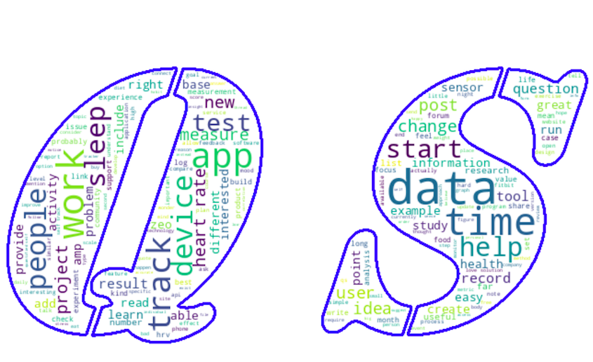

# quantified-self-forums

Self-Quantified is a Community website of self-trackers, self-researchers interested in personal science. It encourages all types of researches to post about their research, ask for advices and explore different methods of self-tracking through wearables.

- Posts by categories with various tags; ‘data’, ‘tools’, ‘diet’, ‘conference’, ‘food’…

  

## Online Dashboard
If you want to have closer look to the results click [INTERACTIVE DASHBOARD HERE](https://share.streamlit.io/kaoutarlanjri/quantified-self-forums/main/webapp/app.py) 

## Expected Results
- The aim of this project is working to understand the community forum by conducting Data Analysis and Natural Language Processing (NLP) of the community’ interactions.
- Providing transparent analysis of the human behaviour in communication and their patterns of networking to improve occurring and future projects in community and personal science.

## Preliminary results
* Clustering PCA Model showing type of user engagement
* LDA MODEL, Topic Modelling showing different posts topics
* Named Entity Recognition, products, organisation, person
* Text Classification 
* Network Social Analysis graph

## Technical Environment
Main Platform: Python and CorTexT Platform. PythonLibraries used for pre-processing data:
NLTK, SPACY, GENISM. * Libraries for modelling, data viz plLDAvis, sklearn, matplotlib, wordcloud, plotly, seaborn, requests, beautiful soup
GEPHI-0.9.2 software for network analysis

